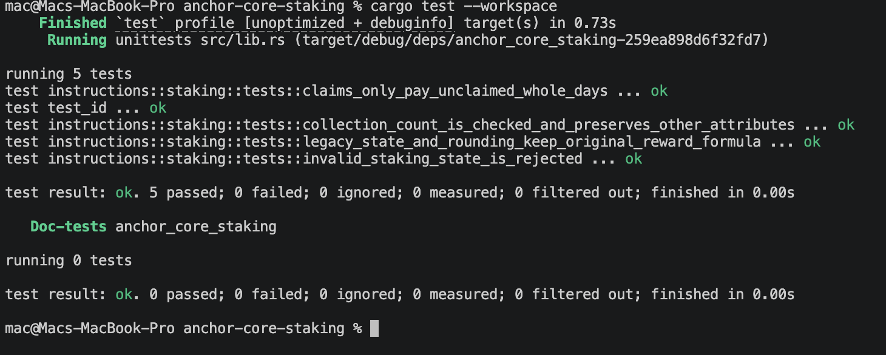

# NFT Staking Core

This is the Turbin3 Week 5 Metaplex Core staking assignment. It extends the instructor's existing staking program with reward claiming, burn-to-earn, and collection-level staking statistics.

## Features

### Claim Rewards Without Unstaking

- Claim accumulated staking rewards, minted to the user's reward-token ATA.
- Track previously claimed rewards to prevent double claims.
- Keep the NFT staked and frozen after claiming.

### Burn-to-Earn

- Permanently burn a staked NFT through the Metaplex Core BurnDelegate flow.
- Mint the remaining staking rewards plus the defined one-time bonus of **1,000 reward tokens**.
- Remove the asset's usable staking state through the burn and update the collection count.

### Collection Staking Stats

- Store `total_staked` in the Collection's Metaplex Core Attributes plugin.
- Increment it on successful stake.
- Decrement it on successful unstake or burn, using checked arithmetic to prevent underflow.

## Program Instructions

- `initialize`: Set the reward rate and freeze period, and create the reward mint.
- `create_collection`: Create a Core collection with its staking count initialized to zero.
- `mint_asset`: Mint a Core NFT into the collection.
- `stake`: Mark the NFT as staked and freeze it.
- `claim_rewards`: Mint unclaimed rewards while keeping the NFT staked.
- `unstake`: Thaw the NFT and pay remaining rewards after the freeze period.
- `burn_staked_nft`: Burn the staked NFT and pay remaining rewards plus the bonus.

## How It Works

Mint NFT → Stake → NFT Frozen → Earn Rewards → Claim or Unstake/Burn

Rewards accrue in complete days. The NFT's Attributes plugin tracks its staking timestamp and claimed rewards, so a claim does not restart the staking period. Unstaking requires the configured freeze period to have elapsed.

## Tech Stack

- Rust
- Anchor
- Solana
- Metaplex Core
- SPL Token
- TypeScript

## Testing

Run the Rust unit tests:

```bash
cargo test --workspace
```

The integration suite uses Surfpool for time travel. After building the program and loading it alongside Metaplex Core on the local Surfpool instance, run:

```bash
anchor test --skip-build --skip-deploy --skip-local-validator
```

Verified assignment results:

- Rust unit tests: **5 passed, 0 failed**.
- Surfpool integration tests: **17 passed, 0 failed**.



The tests cover reward claims, frozen NFT state, repeated claims, burn rewards, restaking, and collection count updates.
